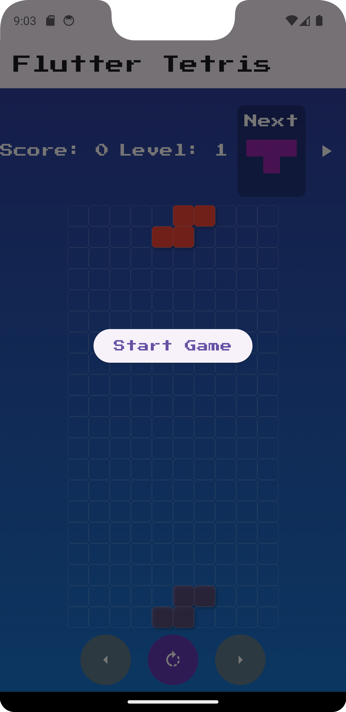
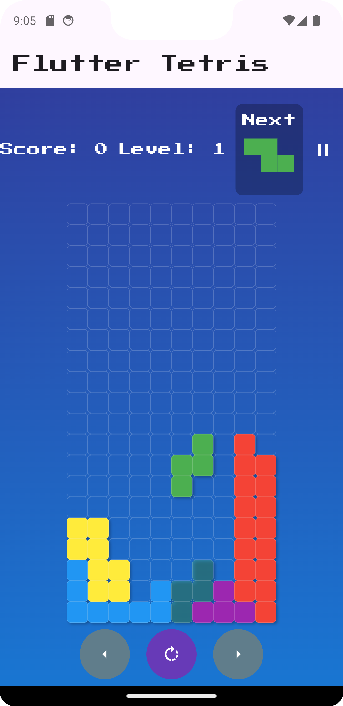

# Flutter Tetris Game

A modern implementation of the classic Tetris game built with Flutter. This project uses the Provider package for state management and provides a fun and interactive experience.

## Features

- **Responsive Gameplay**: Enjoy Tetris on any screen size.
- **Custom Tetromino Shapes**: All classic shapes are included with unique colors.
- **Levels and Speed**: Increase the challenge as you progress through levels.
- **Intuitive Controls**: Swipe and tap for seamless gameplay.

## Screenshots

### Start Screen


### Gameplay


## How to Play

1. Tap the **Start Game** button to begin.
2. Use the following controls:
   - **Swipe Left/Right**: Move the piece left or right.
   - **Swipe Down**: Drop the piece quickly.
   - **Tap**: Rotate the piece.
3. Clear rows to gain points and progress through levels.
4. The game ends when there is no space for a new piece.

## Getting Started

### Prerequisites

- Flutter 3.0.0 or later
- Dart SDK

### Installation

1. Clone the repository:
   ```bash
   git clone https://github.com/Cod-e-Codes/flutter-tetris.git
   cd flutter-tetris
   ```

2. Install dependencies:
   ```bash
   flutter pub get
   ```

3. Run the app:
   ```bash
   flutter run
   ```

## Built With

- [Flutter](https://flutter.dev/)
- [Provider](https://pub.dev/packages/provider)

## License

This project is licensed under the MIT License.

## Created By

CodēCodes  
[Website](https://www.cod-e-codes.com) | [GitHub](https://github.com/Cod-e-Codes)
